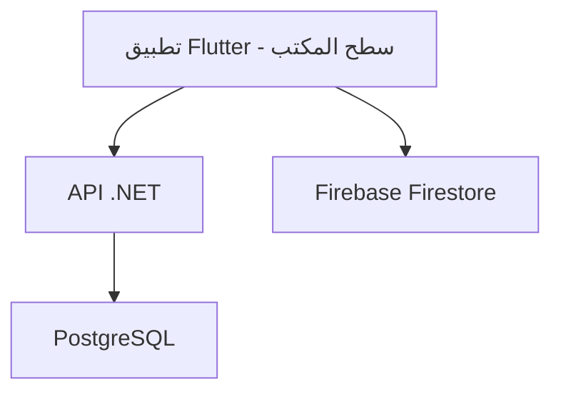
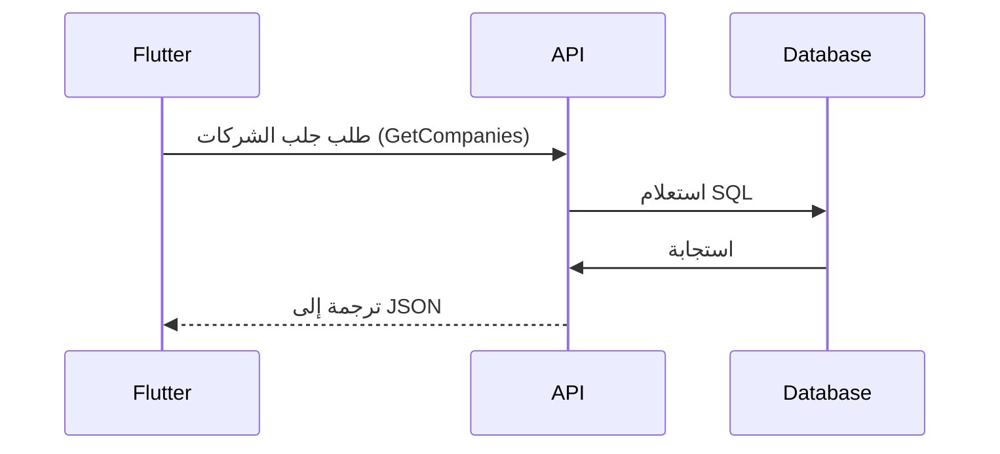
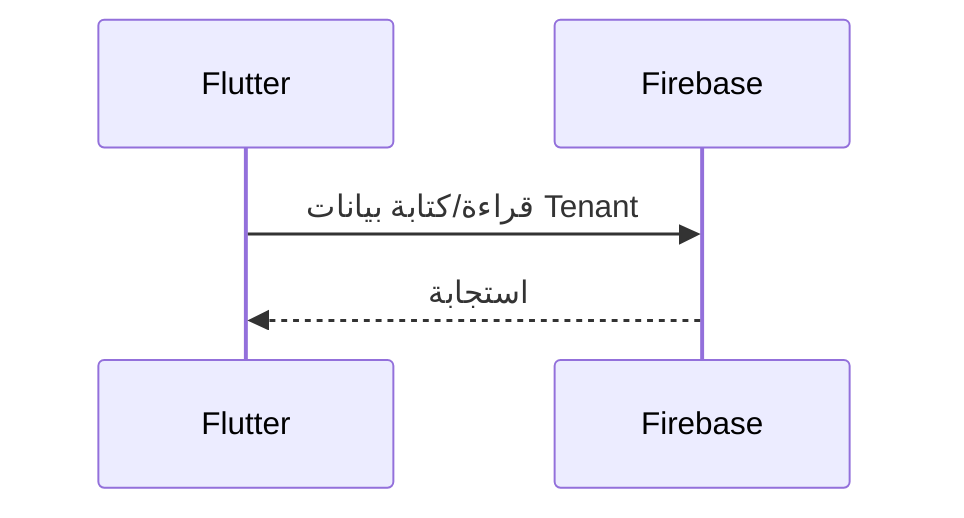
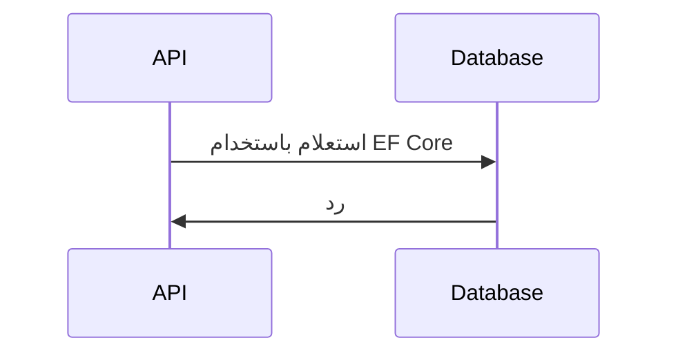

# تحليل شامل لمشروع منصة الصدارة

## 📊 نظرة عامة على النظام

النظام هو منصة متكاملة للشركات لتدعم العمليات التجارية والخدمات التقنية من خلال واجهة سطح المكتب Flutter وتخلفية .NET.

### هيكل النظام:

## 🔍 تحليل شامل للمشاكل المحتملة

### 🎯 1. مشاكل في نظام API .NET

#### 1.1 مشاكل في Archicture و Design Patterns
- **Architecture Issues**: النظام يُستخدم Clean Architecture مع Unit of Work Pattern، ولكن هناك ترابطاً واضحاً بين layers:
  - `InternalDataController.cs` يعتمد مباشرة على `IUnitOfWork` و `SadaraDbContext`
  - `Program.cs` يحتوي على تسجيل مباشر للخدمات بدلاً من Registrar منفصل
- **Unit of Work Pattern**: تنفيذ Unit of Work صحيح ولكن ال repositories مبسطة جداً (لا يوجد validation أو business logic)
- **Dependency Injection**: تسجيل الخدمات مباشرة في Program.cs بدلاً من Extension Methods

#### 1.2 مشاكل في Database Access
- **Missing CompanyRepository**: لا يوجد Repository خاص ب Company، يُستخدم Repository جeneric فقط
- **Soft Delete**: يتم استخدام `IsDeleted` مع Global Query Filter ولكن لا يوجد تاريخ لحذف الشركة
- **EmployeeCount**: في `InternalDataController.GetCompanies()` يُرجع قيمة ثابتة 0 بدلاً من الحساب الفعلي من قاعدة البيانات

#### 1.3 مشاكل في Authentication & Authorization
- **API Key Security**: في `InternalDataController.cs` يتم استخدام API Key ثابت مع硬编码 في الشيفرة
- **CORS Configuration**: في `Program.cs` يتم السماح بالوصول من جميع الأصول (AllowAnyOrigin)
- **JWT Configuration**: في `Program.cs` يتم استخدام Secret Key hardcoded

#### 1.4 مشاكل في API Endpoints
- **Internal API Endpoints**: في `InternalDataController` جميع النقاط النهائية مجهولة (AllowAnonymous) فقط مع تحقق API Key
- **Response Format Inconsistency**: بعض النقاط النهائية تُرجع Array مباشرة (GetCompanies) بينما другие تُرجع Object مع data wrapper
- **Pagination**: في `InternalDataController` لا يوجد دعم للترقيم (pagination)

---

### 📱 2. مشاكل في تطبيق Flutter

#### 2.1 مشاكل في Models
- **Company vs Tenant Inconsistency**: في Flutter يُستخدم `Tenant` بينما في .NET يُستخدم `Company`
- **Data Fields Mismatch**:
  - Flutter: `subscriptionPlan`, `adminUsername`, `adminPassword`
  - .NET: `SubscriptionPlan` (Enum), لا يوجد حقل adminUsername أو adminPassword في Company Entity
- **Features Parsing**: في `Tenant.fromFirestore()` لا يوجد validation للبيانات قبل تحليلها

#### 2.2 مشاكل في API Communication
- **API Client**: في `ApiClient` هناك مشكلة في:
  - لا يوجد Caching للاستجابات
  - لا يوجد Retry Mechanism للطلبات الفاشلة
  - تحليل الاستجابة معقد جداً (يدعم多种 formats)
- **API Key Security**: API Key ثابت hardcoded في `ApiConfig`
- **Connection Timeout**: Duration ثابتة 30 ثانية بدون أي معالجة

#### 2.3 مشاكل في UI & User Experience
- **Unified Companies Page**: في `unified_companies_page.dart`:
  - Load Data Method: يُستخدم `Future.wait` بدون error handling منفصل لكل request
  - Statistics Calculation: في `_statistics` property يتم حساب الحسابات على كل rebuild
  - Status Filtering: في `_getStatusText` لا يوجد دعم لتنسيق الوقت أو معالجة الحالات غير المتوقعة

#### 2.4 مشاكل في State Management
- **Company Status Management**: في `unified_companies_page.dart` يُحسب الحالة فقط عند التحميل
- **Data Syncing**: لا يوجد机制 لсинك البيانات بين API و Firestore
- **Error Handling**: في `_loadCompanies` لا يوجد toast message أو UI feedback للخطأ

---

### 🚀 3. مشاكل في متابعة البيانات (Data Flow)

#### 3.1 Flutter → API → Database Flow

- **المشاكل**:
  - لا يوجد mapping واضح بين Flutter Models و API Models
  - Data Validation غير متكاملة (API يقبل أي بيانات)
  - لا يوجد Logging أو Monitoring لطلبات API

#### 3.2 Flutter ↔ Firebase Firestore Flow

- **المشاكل**:
  - Firestore ليس مصدر بيانات أساسي - فقط للنسخ الاحتياطي
  - لا يوجد机制 لتحقق من الاتساق بين Firestore و API
  - لا يوجد Encryption للبيانات الحساسة في Firestore

#### 3.3 API → Database Flow

- **المشاكل**:
  - Query Optimization: لا يوجد Indexing على الحقول المستخدمة في الفلترة
  - No Tracking Queries: في `InternalDataController.GetCompanies()` يُستخدم AsQueryable() بدون NoTracking
  - Error Handling: في `SaveChangesAsync()` لا يوجد معالجة للاستثناءات

---

### 🛡️ 4. مشاكل في نظام الصلاحيات و الأمان

#### 4.1 Role-Based Access Control (RBAC)
- **Role Definitions**: في `Domain.Enums.UserRole` لا يوجد وصف للrollen
- **Permission Assignment**: في `UserPermission` Entity قليل من التفاصيل
- **Permission Checks**: في `InternalDataController` لا يوجد role-based authorization

#### 4.2 Data Security
- **Admin Password Storage**: في Flutter يُرسل كلمة المرور ناعمة إلى API
- **API Key in Flutter**: API Key hardcoded في `ApiConfig`
- **Sensitive Data Exposure**: في Firestore يُخزن كلمة المرور ببصريّة

#### 4.3 Input Validation
- **Flutter Form Validation**: في `AddCompanyPage` التحقق يدوي بدون packages محددة
- **API Model Validation**: في .NET Controllers لا يوجد Data Annotations أو FluentValidation
- **SQL Injection Prevention**: في `InternalDataController` تم استخدام Parameterized Queries من خلال EF Core

---

### 📈 5. مشاكل في الأداء (Performance)

#### 5.1 Flutter Performance
- **List Rendering**: في `unified_companies_page.dart` Grid View بدون lazy loading
- **Image Loading**: لا يوجد Caching للصور أو Optimisation
- **State Rebuild**: في `_statistics` property يتم حساب الحسابات على كل rebuild

#### 5.2 API Performance
- **Lack of Caching**: في API لا يوجد Memory Cache أو Redis
- **Query Optimization**: في `GetCompanies` يُستخدم Select مع جميع الحقول
- **Response Compression**: في .NET Core لا يوجد Compression للاستجابات

#### 5.3 Database Performance
- **Indexing**: في `SadaraDbContext` قليل من الفهارس
- **Soft Delete**: Global Query Filter يُستخدم في جميع الاستعلامات
- **Connection Pooling**: في `Program.cs` لا يوجد configuration لل Connection Pool

---

### 🔄 6. مشاكل في التكامل بين النظامين

#### 6.1 Data Synchronization
- **No Real-time Sync**: Flutter يُستخدم API فقط للتحديث
- **Firestore Sync**: لا يوجد机制 لсинك البيانات بين VPS و Firebase
- **Offline Support**: في Flutter لا يوجد Cache للبيانات

#### 6.2 Error Handling & Recovery
- **No Retry Logic**: في API Client لا يوجد机制 لإعادة الطلب عند الفشل
- **Fallback Data**: في Flutter لا يوجد data backup إذا فشلت الاتصال بالكتروني
- **Transaction Management**: في API لا يوجد Transaction Scope للعمليات المرتبطة

---

### 🎯 7. مشاكل في كل شاشة / عنصر

#### 7.1 Unified Companies Page (`unified_companies_page.dart`)
- **Load Data**: `_loadData()` يُستخدم Future.wait بدون error handling منفصل
- **Statistics**: `_statistics` property يتم حسابها على كل rebuild
- **Status Filtering**: لا يوجد دعم لmultiple status filtering
- **Search**: البحث يُستخدم contains بدون تحويل إلى lowercase أو uppercase
- **UI Responsiveness**: في حالة وجود عدد كبير من الشركات، الgrid سيصبح بطيئاً

#### 7.2 Add Company Page (`add_company_page.dart`)
- **Form Validation**: التحقق يدوي بدلاً من Form State
- **Code Generation**: `_generateCompanyCode()` يمكن أن يُنتج أسماء مكررة
- **Admin Password**: كلمة المرور يُرسمها ببصريّة أثناء الكتابة
- **Date Selection**: Date Picker باللغة الإنجليزية

#### 7.3 API Client (`api_client.dart`)
- **Timeout**: Duration ثابتة 30 ثانية
- **Response Parsing**: مُعالجة多种 formats من الاستجابات
- **Auth Token Management**: لا يوجد Refresh Token机制
- **Logging**: لا يوجد Logging للطلبات API

---

## 💡 التوصيات التدريجية للتحسين

### المرحلة 1 - الاستCURITY والوثوقية
1. **Secure API Key**: استخدم Environment Variables بدلاً من hardcoded
2. **JWT Configuration**: استخدم Azure Key Vault أو Configuration Providers
3. **HTTPS Enforcer**: يُلزم HTTPS في الإنتاج
4. **Input Validation**: أضف FluentValidation في .NET

### المرحلة 2 - الأداء والفوائد
1. **Caching**: إضافة Redis Cache في API
2. **Lazy Loading**: في Flutter أضف Lazy Loading للشركات
3. **Query Optimization**: إضافة الفهارس في SadaraDbContext
4. **Compression**: включ Response Compression في .NET Core

### المرحلة 3 - الجودة والنموذج
1. **Custom Repositories**: إنشاء CompanyRepository مع business logic
2. **Service Layer**: تطوير Services Layer للعمليات المختلطة
3. **DTO Mapping**: استخدم AutoMapper لتحويل بين Entities و DTOs
4. **Logging & Monitoring**: إضافة Application Insights أو Prometheus

### المرحلة 4 - User Experience
1. **Real-time Sync**: استخدم Firebase Cloud Functions لсинك البيانات
2. **Offline Support**: استخدم Hive أو Isar Database في Flutter
3. **Error Recovery**: أضف Retry Logic في API Client
4. **Performance Metrics**: إضافة Logging للزمن التابع للطلبات

### المرحلة 5 -архитكتure
1. **Clean Architecture**: فصل Business Logic عن Infrastructure
2. **Microservices**: تقسيم API إلى Microservices متعددة
3. **Event Sourcing**: استخدم Event-driven architecture
4. **CQRS**: فصل الـ Query من Command

---

## 📋 مخطط للتنفيذ

| Phase | Task | Priority | Est. Time |
|-------|------|----------|-----------|
| 1 | Secure API Key & JWT | High | 2 days |
| 1 | Add Input Validation | High | 3 days |
| 1 | Configure HTTPS | Critical | 1 day |
| 2 | Add Redis Cache | High | 3 days |
| 2 | Query Optimization | High | 2 days |
| 2 | Lazy Loading in Flutter | Medium | 2 days |
| 3 | Create CompanyRepository | High | 3 days |
| 3 | Implement Services Layer | High | 4 days |
| 3 | Add AutoMapper | Medium | 1 day |
| 4 | Add Real-time Sync | Medium | 5 days |
| 4 | Offline Support | Medium | 4 days |
| 4 | Retry Logic in API Client | High | 2 days |

---

## 🎯 النتيجة النهائية

النظام لديه بنية قوية وارتباطات جيدة، ولكن يحتاج إلى تحسينات في:
1. **الأمان**: خصوصية البيانات و الاعتماد
2. **الأداء**: سرعة الاستجابة و التفاعل
3. **الجودة**: تنظيم الشيفرة و patterns
4. **المستخدم**: تجربة المستخدم و الاخطاء

التحسينات التدريجية ستجعل النظام قادراً على التوسع في المستقبل.
