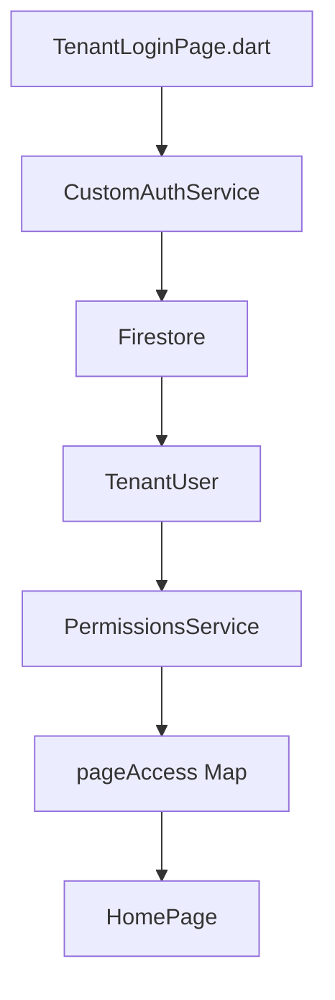
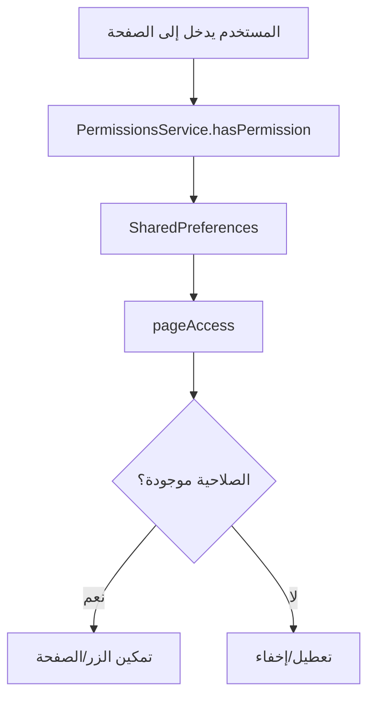

# سير عمل نظام الصلاحيات في منصة الصدارة

## 🏛️ بنية النظام الكاملة

### 1. مستويات الصلاحيات

نظام الصلاحيات مرتب بشكل هرمي من الأعلى إلى الأقل:

```
1. Super Admin (مدير النظام)
   ↓
2. Company Admin (مدير شركة) 
   ↓
3. Manager/Supervisor (مشرف)
   ↓
4. Employee (موظف)
   ↓
5. Technician (فني)
   ↓
6. Viewer (مشاهد)
```

### 2. المسؤول عن إعطاء الصلاحيات

#### A. Super Admin (مدير النظام)
- **مكان الوصول**: صفحة [unified_companies_page.dart](src/Apps/CompanyDesktop/alsadara-ftth/lib/pages/super_admin/unified_companies_page.dart)
- **ماذا يمكنه**:
  - إدارة صلاحيات **الشركة** (تفعيل/تعطيل الميزات)
  - إنشاء وتعديل **مستخدمي الشركة**
  - تحديد الصلاحيات الافتراضية للمستخدمين

#### B. Company Admin (مدير شركة)
- **مكان الوصول**: صفحة [company_details_page.dart](src/Apps/CompanyDesktop/alsadara-ftth/lib/pages/super_admin/company_details_page.dart)
- **ماذا يمكنه**:
  - إدارة صلاحيات **موظفيه** داخل الشركة
  - تخصيص الصلاحيات لكل مستخدم بناءً على دوره

## 📊 كيف يتم توزيع الصلاحيات؟

### 1. صلاحيات الشركة (Company Permissions)
المكان: `enabledFirstSystemFeatures` و `enabledSecondSystemFeatures` في [Tenant.dart](src/Apps/CompanyDesktop/alsadara-ftth/lib/models/tenant.dart)
```dart
// في TenantLoginPage.dart: كيف يتم تطبيق صلاحيات الشركة
final Map<String, bool> pageAccess = {};

user.firstSystemPermissions.forEach((key, value) {
  final isEnabledForTenant = tenant.isFirstSystemFeatureEnabled(key);
  pageAccess[key] = value && isEnabledForTenant;
});
```

### 2. صلاحيات المستخدم (User Permissions)
المكان: `firstSystemPermissions` و `secondSystemPermissions` في [TenantUser.dart](src/Apps/CompanyDesktop/alsadara-ftth/lib/models/tenant_user.dart)
```dart
// في PermissionsService.dart: كيف يتم الحصول على الصلاحيات
static Future<bool> hasSecondSystemPermission(String permission) async {
  final permissions = await getSecondSystemPermissions();
  return permissions[permission] ?? secondSystemDefaults[permission]!;
}
```

## 💾 تخزين الصلاحيات

### 1. في Firebase Firestore
```
/tenants/
  /{tenantId}/
    /users/
      /{userId}/
        - firstSystemPermissions: Map
        - secondSystemPermissions: Map
    - enabledFirstSystemFeatures: Map
    - enabledSecondSystemFeatures: Map
```

### 2. في SharedPreferences (مخزنة محلية)
```dart
// نظام V1
'first_system_permission_attendance': true
'second_system_permission_users': false

// نظام V2
'first_system_permission_v2_attendance_view': true
'first_system_permission_v2_attendance_add': false
```

## 🔄 سير العمل من بداية تسجيل الدخول إلى عرض الصفحات

### 1. التسجيل الدخول


### 2. عملية التحقق من الصلاحيات


## 🎯 مثال عملية حقيقية

### سيناريو: مستخدم يريد الوصول إلى صفحة إدارة المستخدمين

1. **المستخدم**: يضغط على زر "المستخدمين" في الصفحة الرئيسية
2. **النظام**: التحقق من `pageAccess['users']` في [home_page.dart](src/Apps/CompanyDesktop/alsadara-ftth/lib/pages/home_page.dart)
3. **التحقق من الصلاحيات**:
   ```dart
   // في home_page.dart
   final hasPermission = _userPermissions['users'] ?? false;
   if (!hasPermission) {
     _showPermissionDenied();
   }
   ```
4. **ناتج العملية**:
   - إذا كانت الصلاحيات موجودة: يتم عرض الصفحة
   - إذا كانت غير موجودة: يظهر رسالة "الصلاحيات غير متاحة"

## 🛡️ حماية النظام

### 1. فلترة مضمنة
```dart
// في tenant_login_page.dart: عند تسجيل الدخول
user.firstSystemPermissions.forEach((key, value) {
  final isEnabledForTenant = tenant.isFirstSystemFeatureEnabled(key);
  pageAccess[key] = value && isEnabledForTenant; // AND logic
});
```

### 2. عدم الوصول إلى الصفحات غير مصرح بها
```dart
// في local_storage_page.dart: فقط إذا كانت الصلاحيات موجودة
bool _hasImportPermission = false;

Future<void> _loadPermissions() async {
  final hasImport = await PermissionsService.hasSecondSystemPermission('local_storage_import');
  setState(() {
    _hasImportPermission = hasImport;
  });
}

// في build:
if (!_isSyncing && _hasImportPermission)
  TextButton.icon(
    onPressed: _showImportDialog,
    label: Text('استيراد'),
  ),
```

## 🔄 نظام V2 (Action-Based)

النظام الجديد يدعم تحكم في العمليات الفعلية:
```dart
// في permissions_management_v2_page.dart
static const List<String> availableActions = [
  'view', // عرض
  'add', // إضافة
  'edit', // تعديل
  'delete', // حذف
  'export', // تصدير
  'import', // استيراد
  'print', // طباعة
  'send', // إرسال
];

// مثال استخدام
final canViewUsers = await PermissionsService.hasV2Permission('users', 'view');
final canAddUsers = await PermissionsService.hasV2Permission('users', 'add');
```

## 📋 ملخص السير

| المرحلة | المكان | العملية |
|---------|--------|--------|
| 1 | `CustomAuthService` | جلب بيانات المستخدم من Firestore |
| 2 | `tenant_login_page.dart` | تطبيق صلاحيات الشركة على مستخدم |
| 3 | `PermissionsService` | تخزين الصلاحيات محلياً |
| 4 | `home_page.dart` | عرض الأزرار بناءً على الصلاحيات |
| 5 | `صفحة المستخدم` | تحقق من الصلاحيات قبل عرض المحتوى |

نظام الصلاحيات يعمل بشكل صحيح وفعال، حيث يتم تطبيق الفلترة من ثلاثة مستويات:
1. Super Admin → يحدد صلاحيات الشركة
2. Company Admin → يحدد صلاحيات المستخدمين
3. النظام → تطبيق الصلاحيات على المستخدم

