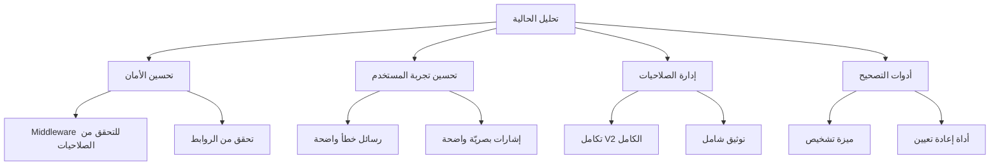

# تحليل شامل لنظام الصلاحيات في منصة الصدارة

## نظرة عامة على النظام

نظام الصلاحيات في منصة الصدارة هو نظام متقدم يدمج بين:
1. **RBAC (Role-Based Access Control)**: تحكم أساسي بناءً على أدوار المستخدمين
2. **Feature-Based Permissions**: تحكم دقيق في كل ميزة من النظام
3. **Action-Based Permissions (V2)**: نظام جديد يسمح بالتحكم في العمليات الفعلية (view, add, edit, delete, export, etc.)

## بنية النظام الحالية

### 1. أنماط الصلاحيات

#### A. نظام الصلاحيات V1 (Feature-Based)
- **نظام الأول**: 5 صلاحيات رئيسية للوظائف الأساسية (الحضور, الوكلاء, المهام, الزونات, البحث بالذكاء الاصطناعي)
- **نظام الثاني**: 25 صلاحية متقدمة لـ FTTH (إدارة المستخدمين, الاشتراكات, الحسابات, WhatsApp, التخزين المحلي, إلخ)

#### B. نظام الصلاحيات V2 (Action-Based)
النظام الجديد يقدم تحكم فني في العمليات:
- view (عرض)
- add (إضافة)
- edit (تعديل)
- delete (حذف)
- export (تصدير)
- import (استيراد)
- print (طباعة)
- send (إرسال)

### 2. أدوار المستخدمين
```dart
enum UserRole {
  Citizen,        // مواطن (زبون)
  Employee,       // موظف
  Technician,     // فني
  Manager,        // مشرف
  CompanyAdmin,   // مدير شركة
  SuperAdmin,     // مدير النظام
}
```

## كيف يعمل التنقل والتحقق من الصلاحيات؟

### 1. عند تسجيل الدخول
في [tenant_login_page.dart](src/Apps/CompanyDesktop/alsadara-ftth/lib/pages/tenant_login_page.dart:135-164):
```dart
// تحويل الصلاحيات إلى Map مع تطبيق صلاحيات الشركة
final Map<String, bool> pageAccess = {};

// صلاحيات النظام الأول (تُفلتر حسب صلاحيات الشركة)
user.firstSystemPermissions.forEach((key, value) {
  final isEnabledForTenant = tenant.isFirstSystemFeatureEnabled(key);
  pageAccess[key] = value && isEnabledForTenant;
});

// صلاحيات النظام الثاني (تُفلتر حسب صلاحيات الشركة)
user.secondSystemPermissions.forEach((key, value) {
  final isEnabledForTenant = tenant.isSecondSystemFeatureEnabled(key);
  pageAccess[key] = value && isEnabledForTenant;
});
```

النظام يقوم ب:
1. جلب صلاحيات المستخدم من Firebase/Firestore
2. تطبيق فلترة مناسبة بناءً على صلاحيات الشركة
3. حفظ النتيجة في `pageAccess` لاستخدامها في التنقل

### 2. في الصفحة الرئيسية
في [home_page.dart](src/Apps/CompanyDesktop/alsadara-ftth/lib/pages/home_page.dart):

#### A. تحميل الصلاحيات
```dart
Future<void> _loadUserPermissions() async {
  final permissions = <String, bool>{};
  for (var key in _defaultPermissions.keys) {
    permissions[key] = widget.pageAccess[key] ?? _defaultPermissions[key]!;
  }
  setState(() => _userPermissions = permissions);
}
```

#### B. عرض الأزرار بناءً على الصلاحيات
```dart
Widget _buildPermissionSwitch({
  required String title,
  required String permissionKey,
  required VoidCallback onTap,
}) {
  final hasPermission = _userPermissions[permissionKey] ?? false;
  
  return InkWell(
    onTap: hasPermission ? onTap : null,  // تمكين/تعطيل الزر
    child: Container(
      decoration: BoxDecoration(
        color: hasPermission ? Colors.blue : Colors.grey.withOpacity(0.5),
      ),
      child: Icon(
        hasPermission ? Icons.arrow_forward_ios_rounded : Icons.lock_rounded,
        color: hasPermission ? Colors.white : Colors.grey,
      ),
    ),
  );
}
```

### 3. في الصفحات الأخرى
المفاهيم نفسها تنطبق على جميع الصفحات:
- في [local_storage_page.dart](src/Apps/CompanyDesktop/alsadara-ftth/lib/pages/local_storage_page.dart): تحقق من صلاحية الاستيراد قبل عرض الزر
- في [user_details_page.dart](src/Apps/CompanyDesktop/alsadara-ftth/lib/pages/user_details_page.dart): عرض وредактирование صلاحيات المستخدمين
- في [permissions_management_v2_page.dart](src/Apps/CompanyDesktop/alsadara-ftth/lib/pages/super_admin/permissions_management_v2_page.dart): إدارة صلاحيات V2

## خدمات إدارة الصلاحيات

### 1. PermissionsService
الخدمة الرئيسية في [permissions_service.dart](src/Apps/CompanyDesktop/alsadara-ftth/lib/services/permissions_service.dart):
- **نظام V1**:
  - `getFirstSystemPermissions()`, `getSecondSystemPermissions()`
  - `saveFirstSystemPermissions()`, `saveSecondSystemPermissions()`
  - `hasFirstSystemPermission()`, `hasSecondSystemPermission()`

- **نظام V2**:
  - `getFirstSystemPermissionsV2()`, `getSecondSystemPermissionsV2()`
  - `saveFirstSystemPermissionsV2()`, `saveSecondSystemPermissionsV2()`
  - دعم للتحويل من V1 إلى V2 تلقائيًا

### 2. FirestorePermissionsService
في [firestore_permissions_service.dart](src/Apps/CompanyDesktop/alsadara-ftth/lib/services/firestore_permissions_service.dart):
- جلب صلاحيات المستخدم من Firestore
- تحقق من صلاحيات الشركة
- دعم للترحيل من أنظمة القديمة

### 3. vps_auth_service
في [vps_auth_service.dart](src/Apps/CompanyDesktop/alsadara-ftth/lib/services/vps_auth_service.dart):
- تحليل صلاحيات المستخدم من JSON
- دعم للأنظمة القديمة والجديدة

## نقاط القوة في النظام

### 1. تصميم منظم
- فصل واضح بين النظامين (النظام الأول, النظام الثاني)
- دعم للتحويل من V1 إلى V2
- تخزين محلي آمن باستخدام SharedPreferences

### 2. أمان ممتاز
- تطبيق صلاحيات الشركة على مستوى المستخدم
- فلترة مضمنة عند تسجيل الدخول
- عدم عرض أي ميزات غير مصرح بها

### 3. تجربة مستخدم ممتازة
- أيقونات مفصلة (مفتوحة/مقفلة)
- رسائل خطأ واضحة
- تصميم متجاوب

### 4. إدارة منظمة
- صفحات إدارة صلاحيات شاملة (V1 و V2)
- دعم للطبقات المختلفة من المستخدمين
- سجلات وتوثيق مرجعي

## نقاط الضعف ومقترحات التحسين

### 1. نقاط الضعف الرئيسية

#### A. في التنقل
- **الأمان**: عدم وجود حماية على مستوى الروابط (يمكن للمستخدمين التخمين لصفحات غير مصرح بها)
- **التجربة**: عندما يُضغط على زر غير مصرح به، لا تظهر رسالة واضحة

#### B. في إدارة الصلاحيات
- **V2**: تنفيذ غير مكتمل في API
- **التوثيق**: عدم وجود وثائق للصلاحيات المتاحة
- **التصحيح**: صعوبات في تحديد المشاكل في الصلاحيات

### 2. مقترحات التحسين

#### A. تحسين الأمان
1. **Middleware للتحقق من الصلاحيات**:
   ```dart
   // في auth_guard.dart - إضافة middleware للتحقق من الصلاحيات
   class PermissionGuard extends StatelessWidget {
     final Widget child;
     final String requiredPermission;
   
     const PermissionGuard({
       super.key,
       required this.child,
       required this.requiredPermission,
     });
   
     @override
     Widget build(BuildContext context) {
       return FutureBuilder<bool>(
         future: PermissionsService.hasSecondSystemPermission(requiredPermission),
         builder: (context, snapshot) {
           if (snapshot.hasData && !snapshot.data!) {
             return const PermissionDeniedPage();
           }
           return child;
         },
       );
     }
   }
   ```

2. **التحقق من الروابط**:
   - إضافة تحقق من الصلاحيات في الروтера
   - عدم سماح للوصول إلى أي صفحة غير مصرح بها

#### B. تحسين تجربة المستخدم
1. **رسائل خطأ واضحة**:
   ```dart
   // في home_page.dart - تحسين رسالة الن отказ الصلاحيات
   void _showPermissionDenied() {
     showDialog(
       context: context,
       builder: (context) => AlertDialog(
         title: const Text('الصلاحيات غير متاحة'),
         content: const Text('لا تمتلك الصلاحيات الكافية للوصول إلى هذه الصفحة'),
         actions: [
           TextButton(
             onPressed: () => Navigator.pop(context),
             child: const Text('إغلاق'),
           ),
         ],
       ),
     );
   }
   ```

2. ** индиكаторات واضحة**:
   - إضافة وسوم أو شعارات لبيان الصلاحيات في القوائم
   - تغيير لون الأزرار بناءً على الحالة

#### C. تحسين إدارة الصلاحيات
1. **تكامل V2 الكامل**:
   - إكمال endpoints API في InternalDataController
   - إضافة صفحات إدارة صلاحيات V2 شاملة

2. **التوثيق**:
   - إنشاء مستند شامل لكل صلاحية وردود الفعل المتاحة
   - إضافة أمثلة استخدام الصلاحيات في الشيفرة

3. **أدوات التصحيح**:
   - إضافة ميزة تشخيص للصلاحيات في ملف Diagnostics
   - إنشاء أداة إعادة تعيين الصلاحيات إلى الحالة الافتراضية

#### D. تحسين الأداء
1. **مخزنة الصلاحيات**:
   - إضافة cache لصلاحيات المستخدم
   - تحسين وقت تحميل الصلاحيات

2. **التحقق من الصلاحيات**:
   - تحسين فعالية الدوال hasPermission
   - إضافة تحقق من الصلاحيات إلى level أعمق من UI

#### E. تحسين الأدوات
1. **أداة إدارة الصلاحيات**:
   - إضافة واجهة تفاعلية لإنشاء قوالب الصلاحيات
   - إضافة واجهة للتحقق من صلاحيات مستخدم معين

## ملخص الحالة الحالية

نظام الصلاحيات في منصة الصدارة هو نظام قوي ومستقر. إليه تحسينات واضحة في:
1. الأمان (middleware للتحقق من الصلاحيات)
2. تجربة المستخدم (رسائل خطأ واضحة)
3. إدارة الصلاحيات (تكامل V2 الكامل)
4. الأدوات (أدوات تصحيح وتوثيق)

## خطوات التنفيذ المقترحة



---

## الخلاصة

نظام الصلاحيات في منصة الصدارة يعمل بشكل صحيح وفعال في:
- تقييد الوصول إلى الصفحات والأزرار بناءً على الصلاحيات
- تطبيق فصل صحيح بين مستوى الشركة ومستوى المستخدم
- تقديم تجربة مستخدم ممتازة

إلا أن هناك تحسينات واضحة يمكن تطبيقها لجعل النظام أكثر أمانًا ومرونة.
