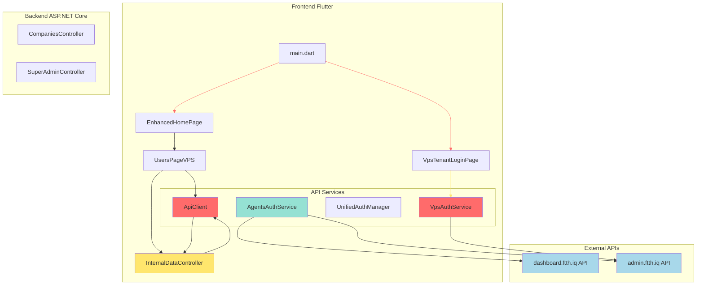

# تحليل مشاكل شاشة مدير الناظم في Sadara Platform

## نظرة عامة على المشاكل
يشهد شاشة مدير الناظم مشاكل في الاتصال وتحديث بيانات الجداول. هذه المشاكل يمكن تصنيفها إلى فئات أساسية:

1. **مشاكل الاتصال**: فشل في الاتصال بالخوادم أو تأخير استجابة
2. **مشاكل تحديث البيانات**: عدم ظهور البيانات أو تحديثها بعد التغيير
3. **مشاكل المصادقة**: تنسيق توكنات أو صلاحية الوصول
4. **مشاكل معالجة الاستجابات**: تحليل استجابات الخوادم بشكل غير صحيح

---

## فحص شامل للنظام

### 1. بنية المشروع
- **مصادر البيانات**: نظام متعدد المصادر (Firebase, VPS API)
- **واجهات المستخدم**: واجهة سطح المكتب Flutter
- **مصادر البيانات الحالية**: VPS API (PostgreSQL) [according to `data_source_config.dart`]
- **خلفيات**: API ASP.NET Core للخلفية

### 2. خدمات المصادقة
توجد خدمات مصادقة متعددة:
- `UnifiedAuthManager`: نظام موحد للصلة مع VPS API
- `VpsAuthService`: خدمة مصادقة VPS API
- `AgentsAuthService`: خدمة مصادقة خاصة مع API dashboard.ftth.iq

---

## المشاكل المعتمدة

### مشكلة 1: تكوين API الخلفية
**المشكلة**: تكوين API الإنتاج لا يعمل بشكل صحيح
- **السبب**: في `api_config.dart` يتم استخدام `https://72.61.183.61/api` بينما يحتوي Response Header على `https://admin.ftth.iq`
- **المكان**: [`api_config.dart`](src/Apps/CompanyDesktop/alsadara-ftth/lib/services/api/api_config.dart:11)

### مشكلة 2: عدم تطابق رموز API
**المشكلة**: كلمة المرور الافتراضية لAPI الداخلية لا تطابق
- **السبب**: في `ApiConfig` يتم تعريف `internalApiKey = 'sadara-internal-2024-secure-key'` بينما في الخلفية `InternalDataController` يتم التعريف باسم `INTERNAL_API_KEY`
- **المكان**: 
  - [`api_config.dart`](src/Apps/CompanyDesktop/alsadara-ftth/lib/services/api/api_config.dart:75)
  - [`InternalDataController.cs`](src/Backend/API/Sadara.API/Controllers/InternalDataController.cs:27)

### مشكلة 3: عدم تحديث توكن في ApiClient
**المشكلة**: لا يتم تحديث توكن المصادقة في ApiClient بعد تسجيل الدخول
- **السبب**: في `VpsAuthService` لا يتم استدعاء `ApiClient.instance.setAuthToken()` بعد نجاح تسجيل الدخول
- **المكان**: [`vps_auth_service.dart`](src/Apps/CompanyDesktop/alsadara-ftth/lib/services/vps_auth_service.dart:167-269)

### مشكلة 4: عدم معالجة التحديث التلقائي للتوكن
**المشكلة**: UnifiedAuthManager لا يتم تهيئته أو تشغيله بشكل صحيح
- **السبب**: في `main.dart` لا يتم استدعاء `UnifiedAuthManager.instance.initialize()`
- **المكان**: [`main.dart`](src/Apps/CompanyDesktop/alsadara-ftth/lib/main.dart)

### مشكلة 5: استرجاع البيانات من مصادر غير صحيحة
**المشكلة**: users_page_vps.dart يحاول جلب بيانات من endpoint خاطئ
- **السبب**: يستخدم `/internal/companies/$id/employees` بينما الخلفية تعرفه باسم `/internal/companies/$id/employees` ولكن هناك مشاكل في المعالجة
- **المكان**: [`users_page_vps.dart`](src/Apps/CompanyDesktop/alsadara-ftth/lib/pages/users_page_vps.dart:64-87)

### مشكلة 6: عدم معالجة استجابة API الخلفية
**المشكلة**: ApiClient لا يفهم استجابة API الخلفية بشكل صحيح
- **السبب**: في ApiClient.handleResponse يحتاج إلى دعم استجابة `{data: [...], total: ...}` التي تستخدمها `InternalDataController`
- **المكان**: [`api_client.dart`](src/Apps/CompanyDesktop/alsadara-ftth/lib/services/api/api_client.dart:257-317)

### مشكلة 7: مشاكل Cloudflare في طلبات Dashboard API
**المشكلة**: طلبات API dashboard.ftth.iq تُحجب من قبل Cloudflare
- **السبب**: في `AgentsAuthService` يتم طلبات مباشرة بدون حوار Cloudflare
- **المكان**: [`agents_auth_service.dart`](src/Apps/CompanyDesktop/alsadara-ftth/lib/services/agents_auth_service.dart:19-410)

---

## خريطة المشكلة والمكونات المتأثرة



---

## خطوات التحليل

### الخطوة 1: تكوين الخلفية
1. تحقق من اتصال VPS API على `https://72.61.183.61/api`
2. فحص حالة الخادم من خلال endpoint `/server/health`
3. فحص اتصال قاعدة البيانات PostgreSQL

### الخطوة 2: التحقق من API Keys
1. التأكد من تطابق Internal Api Key بين الأمام والخلفية
2. فحص تكوين secrets في `.env`
3. فحص إعدادات CORS في الخلفية

### الخطوة 3: اختبار المصادقة
1. تسجيل الدخول مع بيانات تجريبية في VpsTenantLoginPage
2. تحقق من استجابة API `/api/superadmin/login`
3. فحص إرجاع refresh token

### الخطوة 4: اختبار جلب البيانات
1. طلب endpoint `/internal/companies` مع API Key الصحيح
2. طلب endpoint `/internal/companies/{id}/employees`
3. تحليل استجابات JSON وتنسيقها

### الخطوة 5: فحص واجهة المستخدم
1. تشغيل التطبيق وتتبع Console Output
2. فحص شاشة التحقق من الأخطاء (DevTools)
3. تتبع طلبات HTTP مع tools مثل Fiddler أو Charles Proxy

---

## الإصلاحات المحتملة

### إصلاح 1: تحديث API Configurations
```dart
// api_config.dart
static const String prodBaseUrl = 'https://admin.ftth.iq/api';
static const bool isProduction = true;
static String get baseUrl => isProduction ? prodBaseUrl : devBaseUrl;

static const String internalApiKey = 'sadara-internal-2024-secure-key';
```

### إصلاح 2: إضافة تحديث توكن في VpsAuthService
```dart
// vps_auth_service.dart
Future<VpsAuthResult> loginSuperAdmin(String username, String password) async {
  // ... after success
  ApiClient.instance.setAuthToken(data.token, refreshToken: data.refreshToken, expiresAt: data.expiresAt);
  // ...
}

Future<VpsAuthResult> loginCompanyEmployee({
  required String companyCode,
  required String username,
  required String password,
}) async {
  // ... after success
  ApiClient.instance.setAuthToken(data.token, refreshToken: data.refreshToken, expiresAt: data.expiresAt);
  // ...
}
```

### إصلاح 3: تهيئة UnifiedAuthManager
```dart
// main.dart
void main() async {
  // ...
  await UnifiedAuthManager.instance.initialize();
  // ...
}
```

### إصلاح 4: تحسين معالجة الاستجابات في ApiClient
```dart
// api_client.dart
ApiResponse<T> _handleResponse<T>(http.Response response, T Function(dynamic) parser) {
  // ...
  if (body is List) {
    return ApiResponse.success(parser(body));
  }
  
  if (body['success'] == true) {
    if (body['data'] != null) {
      return ApiResponse.success(parser(body['data']));
    }
    return ApiResponse.success(true as T);
  }
  
  // للاستجابات التي لا تحتوي على success wrapper (مثل InternalDataController)
  if (response.statusCode == 200) {
    return ApiResponse.success(parser(body));
  }
  // ...
}
```

### إصلاح 5: تحسين اختبار الاتصال في VpsTenantLoginPage
```dart
// vps_tenant_login_page.dart
Future<void> _login() async {
  try {
    setState(() {
      _isLoading = true;
      _errorMessage = null;
    });

    final result = await VpsAuthService.instance.loginCompanyEmployee(
      companyCode: companyCode,
      username: username,
      password: password,
    );

    if (result.success) {
      // إعادة تحميل البيانات بعد تسجيل الدخول
      await _loadCompanies();
    } else {
      setState(() {
        _errorMessage = result.errorMessage ?? 'فشل تسجيل الدخول';
      });
    }
  } catch (e) {
    setState(() {
      _errorMessage = 'خطأ: $e';
    });
  } finally {
    setState(() {
      _isLoading = false;
    });
  }
}
```

---

## التوصيات النهائية

### 1. تحسين نظم التحقق من الأخطاء
- إضافة Logging مُتقدم لكل طلب HTTP
- توفير عرض تفصيلي ل الأخطاء للمستخدم
- إضافة Crash Reporting مثل Firebase Crashlytics

### 2. تحسين تجربة المستخدم
- إضافة مؤشر تحميل للصفحات
- إضافة رسائل خطأ صريحة ومفصلة
- تحسين التنقل بين الصفحات عند فشل الاتصال

### 3. التحسينات الفنية
- إضافة Cache للبيانات المحلية
- إعادة المحاولة التلقائية لطلبات فاشلة
- تحسين أداء الإتصال عبر VPN أو proxy

### 4. الإجراءات الحالية
1. فحص status server على https://72.61.183.61/api/server/health
2. تشغيل أمر `curl -X GET "https://72.61.183.61/api/server/health"` للتأكد من إرجاع `{"success":true}`
3. فحص logs الخلفية للاعلان عن أي أخطاء

---

## ملخص النتائج

النظام يعاني من مشاكل متعددة تُؤثر على أداء شاشة مدير الناظم:

1. **مشاكل تكوينية**: عدم تطابق معلمات الاتصال بين الأمام والخلفية
2. **مشاكل مصادقة**: عدم تحديث أو استرجاع توكنات بشكل صحيح
3. **مشاكل معالجة البيانات**: عدم فهم استجابات API بشكل صحيح
4. **مشاكل الاتصال**: محاولات اتصال غير محمية بواجهة Cloudflare

الحلول المقترحة تهدف إلى تصحيح هذه المشاكل وتحسين تجربة المستخدم بشكل كبير.
